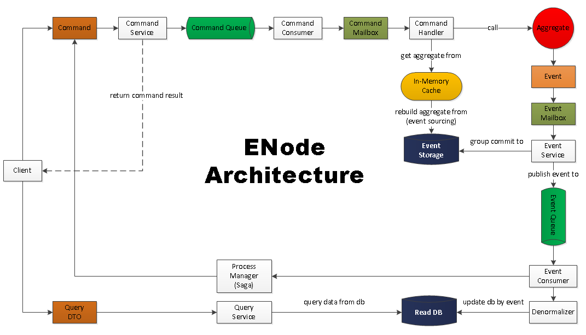

# DDD/CQRS/ES 架构的调研

> DDD Domain Driven Design

> CQRS表示Command Query Responsibility Segregation，即命令和查询责任分离，是由Greg Young提出的一种将系统的读（查询）、写（命令）操作分离为两种独立子系统的架构模式。在一些应用场景下，这种分离是很有价值的，但要注意，CQRS对大多数系统而言，让系统变得更加复杂。

> ES Event Sourcing

## bus 事件总线
- publish/subscribe
- sending/receiving
- broadcast

## event driven 事件驱动

## command handle

## CQRS 命令与查询责任分离

##  ENode C# 架构图

## 重点
1. 一个 aggregate 里，利用 mq 将 eventStore + publish 两件事合成一个原子操作
2. 所有的 store 转为幂等操作，即 upsert 
3. 跨 aggregate, 采用 saga
4. saga 补偿理解：作为一个额外系统对业务数据不一致，进行类似取消的操作。

## 理解难点

1. Aggregate in-memory 的设计
2. 分布式 command, 一个事务只修改一个 aggregate
3. Saga 设计 (独立服务)

## 参考

### 博文
[nodejs-microservices-event-sourcing-cqrs](http://slides.com/stefankutko/nodejs-microservices-event-sourcing-cqrs)

[event-sourcing-in-practice](https://ookami86.github.io/event-sourcing-in-practice/)

[cqrs-explained-node-js-at-scale](https://blog.risingstack.com/cqrs-explained-node-js-at-scale/)

### C#, 汤雪华
[DDD ES 架构分享](http://www.cnblogs.com/netfocus/p/4150084.html)

[微服务架构下的事务一致性保证](https://yq.aliyun.com/articles/66109)

### 前端, react & flux
[almin](https://github.com/almin/almin)

[Flux与Redux背后的设计思想(二)：CQRS, Event Sourcing, DDD](https://zhuanlan.zhihu.com/p/25383827)

### 后端, NodeJs
[node-cqrs 全家桶](http://cqrs.js.org/pages/eventedcommand.html)

[基于 node-cqrs example](https://github.com/jamuhl/nodeCQRS)

[coffescript 写的CQRS 架构 eventric](https://github.com/efacilitation/eventric)

[基于 Actor 的CQRS](https://github.com/liangzeng/cqrs)